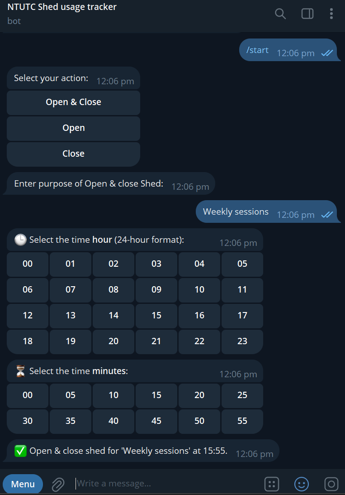

# 🎾 NTUTC Shed Log Bot

This is a Telegram bot that allows NTU Tennis Club EXCO to log when they open or close the shed, including logging purpose and time into a Google Sheet, and posting a message to a Telegram channel.

---

## Table of Contents

- [Features](#features)
- [Project Structure](#project-structure)
- [Setup Guide](#setup-guide)
  - [Prerequisites](#prerequisites)
  - [Step 1: Create and Prepare .env File](#step-1-create-and-prepare-env-file)
  - [Step 2: Create a Telegram Bot](#step-2-create-a-telegram-bot)
  - [Step 3: Create a Google Sheet](#step-3-create-a-google-sheet)
  - [Step 4: Set Up Google Cloud](#step-4-set-up-google-cloud)
  - [Step 5: Create Google Service Account](#step-5-create-google-service-account)
  - [Step 6: Add the Bot to a Telegram Channel](#step-6-add-the-bot-to-a-telegram-channel)
  - [Step 7: Setup Uptime Monitoring with UptimeRobot](#step-7-setup-uptime-monitoring-with-uptimerobot)
- [Deployment (Windows)](#deployment-windows)
- [How to Use the Bot](#how-to-use-the-bot)
- [Notes](#notes)
- [Logging to Private Telegram Group Topic](#optional-log-to-a-telegram-group-topic)

---

## Features

- Telegram Bot with inline button-based interaction
- Custom hour/minute time picker (5-minute steps)
- Google Sheets logging (free 5000 interference per month)
- Google Cloud Run deployment (24/7 uptime)
- Private Channel support with real-time updates

Service provider: Google cloud run
Monitoring bot: UptimeRobot

---

## Project Structure

```
🗂️ntutc_shed_bot/
├── ntutc_shed_bot.py        # Main bot logic
├── requirements.txt         # Python dependencies
├── Dockerfile               # Container build instructions
├── deploy.ps1               # Windows deployment script
├── .env                     # Secrets and environment variables (MUST .gitignore)
├── google_credentials.json  # Temporary file for encoding Google credentials (MUST .gitignore)
├── .gitignore               
├── .gcloudignore            
├── .dockerignore
```

---

## Setup Guide

---

### Prerequisites: 

📌Clone this repository to your local development environment.

📌Google Cloud Account

Sign up at [Google Cloud Console](https://console.cloud.google.com/).  
New users get USD $300 free credits (as of 11 March 2025).  
Enable billing (you won’t be charged if you stay within the free tier).

---

### Step 1: Create and Prepare .env File

Start by creating a 🗂️`.env` file to track all your credentials:

```env
PROJECT_ID=your_google_cloud_project_id
SERVICE_NAME=ntutc-shed-bot
TELEGRAM_BOT_TOKEN=your_telegram_bot_token
CHANNEL_USERNAME=-100xxxxxxxxxx
SPREADSHEET_ID=your_google_sheet_id
GOOGLE_CREDENTIALS_JSON=base64_encoded_service_account_json
UPTIMEROBOT_API_KEY=your_uptimerobot_api_key
CLOUD_RUN_URL=https://your-cloud-run-url.a.run.app
```

📋You will fill in the above values as you go through the steps.

---

### Step 2: Create a Telegram Bot

1. Open 👉[@BotFather](https://t.me/BotFather) on Telegram.
2. Use `/newbot` and follow prompts.
3. Note the 📝`TELEGRAM_BOT_TOKEN` and paste it in your 🗂️`.env`.

---

### Step 3: Create a Google Sheet

1. Go to 👉[Google Sheets](https://sheets.google.com).
2. Create a new sheet with this first row:
   ```
   Username | Action | Purpose | Date | Time | Submitted At | Message ID
   ```
3. Copy the long string in the URL — that is your 📝`SPREADSHEET_ID`.

---

### Step 4: Set Up Google Cloud

1. Visit 👉[Google Cloud Console](https://console.cloud.google.com/).
2. Create a new project and write down the 📝`PROJECT_ID`.

Navigate to APIs & Services > Library
Enable the following APIs:
- Google Sheets API
- Cloud Run API
- Cloud Build API
- IAM API

---

### Step 5: Create Google Service Account

1. Go to IAM & Admin > Service Accounts.
2. Create a new account with roles:
   - Editor
   - Service Account Token Creator
3. Create a JSON key and download it as 🗂️`google_credentials.json`.

Convert it to base64:
```bash
base64 google_credentials.json > encoded.txt
```
Paste the content of 🗂️`encoded.txt` into 📝`GOOGLE_CREDENTIALS_JSON` in your 🗂️`.env`.

---

### Step 6: Telegram Private Channel hooking

1. Ensure that your channel is private.
2. Use 👉[@getidsbot](https://t.me/getidsbot) to find the channel's numeric ID.
3. Use that as 📝`CHANNEL_USERNAME` (e.g., `-100xxxxxxxxxx`).

(Optional)
The bot can also send logs to a **specific topic (thread)** in a **private Telegram group**. 
👉[Logging to Private Telegram Group Topic](#optional-log-to-a-telegram-group-topic)

---

### Step 7: Setup Uptime Monitoring with UptimeRobot

1. Sign up at 👉[uptimerobot.com](https://uptimerobot.com).
2. Create a monitor with:
   - Monitor Type: HTTP(s)
   - Friendly Name: Shed Bot Health
   - URL: `https://your-cloud-run-url/health`
   - Monitoring Interval: 5 minutes

3. To use UptimeRobot’s API:
   - Go to My Settings > API Settings
   - Copy your Main API Key
   - Paste it into 🗂️`.env` as 📝`UPTIMEROBOT_API_KEY`

---


## Deployment (Windows)

1. Download and install the Google Cloud SDK 👉[Google Cloud CLI](https://cloud.google.com/sdk/docs/install).
2. After installation, authenticate your account:

```bash
gcloud auth login
```
3. Then, select or create your project:

```bash
gcloud config set project YOUR_PROJECT_ID
```

4. Run the following command to enable Cloud Run and Cloud Build:

```bash
gcloud services enable run.googleapis.com cloudbuild.googleapis.com
```

---
5. Run and Deploy:
   ```
   .\deploy.ps1
   ```

This script deploys your bot and sets up the environment on Cloud Run.

6. Add your bot to the private channel as **Admin**. It will send the logs there real-time.

---

## How to Use the Bot

1. Start the bot on Telegram using `/start`.
2. Choose an action (Open, Close, or Open & Close).
3. Enter or select the purpose.
4. Choose the hour and minute using inline buttons.
5. Your input will be logged to both Telegram Channel and Google Sheets.

| Telegram Bot Interaction |
|--------------------------|
|  |

---

## Notes

- Channel must be private, and bot must have admin permissions to post messages.
- Ensure `requirements.txt` includes `python-telegram-bot`, `gspread`, `oauth2client`, and `quart`.
- Quart is used to handle incoming webhook requests from Telegram via Google Cloud Run.

---

### Optional: Log to a Telegram Group Topic

#### Step 1: Convert Group to Supergroup

- Go to your group settings → More → “Convert to Supergroup” (if not already done).

#### Step 2: Enable Topics

- Enable “Topics” under group settings.
- Create a topic like **Logs**.

#### Step 3: Get the Chat ID and Thread ID

1. Temporarily modify your bot code to print received messages.
2. Add this handler to capture messages:
```python
#Temporary functions for obtaining chat_id and message_thread_id
async def debug_log_ids(update: Update, context: CallbackContext):
    if update.message:
        print("Chat ID:", update.effective_chat.id)
        print("Message Thread ID:", update.message.message_thread_id)

application.add_handler(MessageHandler(filters.ALL, debug_log_ids))
```

3. Register the handler and send a message in the target topic.
4. Note down both IDs from logs in google run.

#### Step 4: Update Your .env File

```env
CHANNEL_USERNAME=-100xxxxxxxxxx       # your private group ID
TOPIC_THREAD_ID=your_topic_thread_id  # the thread/topic ID
```

#### Step 5: Deploy

- Make sure your deployment includes `TOPIC_THREAD_ID`.
- The bot will automatically send to that topic if the value is provided.

> If no topic ID is present, the bot will send to the main chat/channel as default.
